[](https://gitpod.io/#https://github.com/JaleneA/SCT-JaleneA)


# Student Conduct Tracker
Staff System For Recording Positive & Negative Experiences With Students.

## Project Requirements
* Add Student
* Review Student
* Search Student
* View Student Reviews

## Flask Commands
wsgi.py is a utility script for performing various tasks related to the project.

### Admin Commands
```bash
$ flask admin create_staff Mrs. Bubble Bub bubble.bub@staff.com N bubblepass 1
```
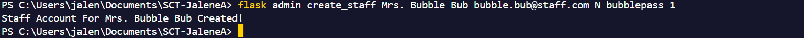

```bash
$ flask admin create_staff 
```
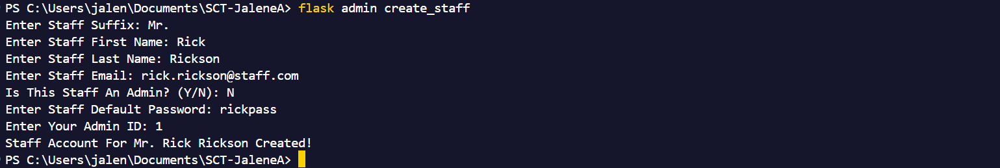

```bash
$ flask admin list_staff 
```
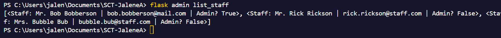

### Staff Commands
```bash
$ flask staff add_student 816031000 Bobby Butterbeard bobby.butterbread@mail.com
```
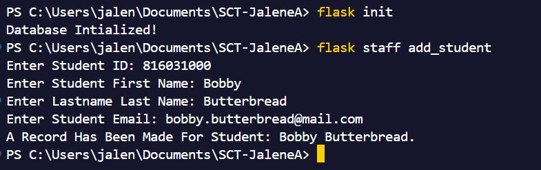

```bash
$ flask staff add_student
```
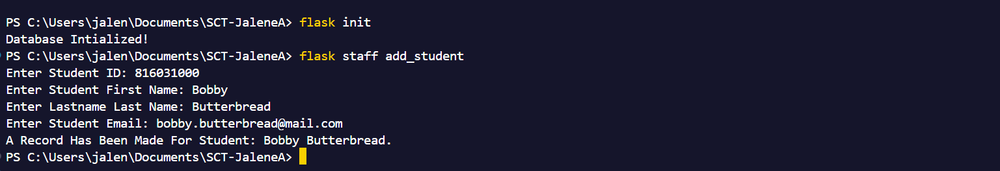

```bash
$ flask staff add_students students.csv
```
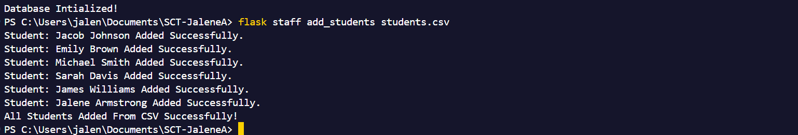

```bash
$ flask staff add_students
```
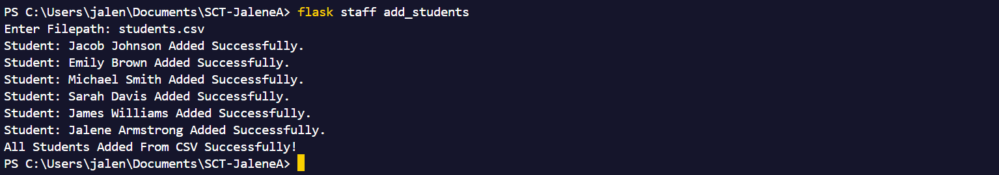

```bash
$ flask staff review 816031000 Overall Good Student 1
```


```bash
$ flask staff review
```
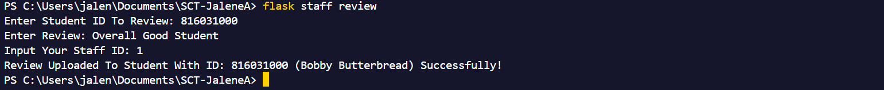

```bash
$ flask staff view_student_reviews 816031000
```
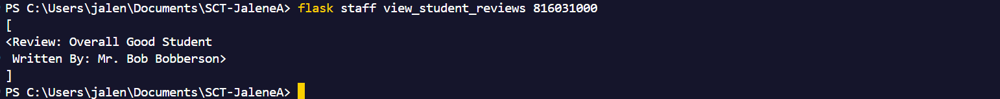

```bash
$ flask staff search_student 816031000
```
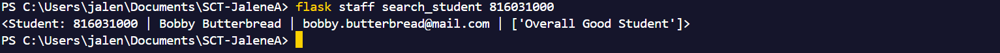

```bash
$ flask staff list_student
```
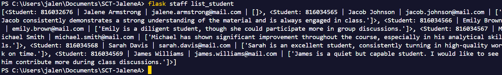

## Dependencies
* Python3/pip3
* Packages listed in requirements.txt

## Installing Dependencies
```bash
$ pip install -r requirements.txt
```

